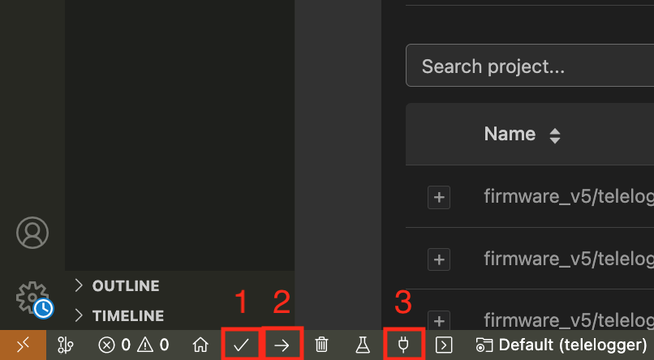

&nbsp;
&nbsp;
<p align="center">
  
</p> 

&nbsp;

# Autoencoders for Embedded Sensor Data Compression: A Case Study on Vehicular IoT Systems

### ✍🏾 Authors: [Matheus Andrade](https://github.com/DinizMaths), [Miguel Amaral](https://github.com/MiguelEuripedes), [Morsinaldo Medeiros](https://github.com/Morsinaldo), [Marianne Diniz](https://github.com/MarianneDiniz), [Ivanovitch Silva](https://github.com/ivanovitchm)

---

## 📖 Abstract

The growing integration of sensors and embedded devices into distributed Internet of Things (IoT) systems has increased the demand for real-time data collection and processing solutions. However, the high volume and frequency of sensor data create challenges related to storage, transmission, and response latency, especially in resource-constrained environments. In this context, locally executed compression techniques, aligned with the Tiny Machine Learning (TinyML) paradigm, become differentiators for enabling embedded applications. Thus, this work proposes an autoencoder-based approach for efficiently compressing sensor data on edge devices. Three autoencoder variants (feedforward, sparse, and contractive) are evaluated, combined with symmetric and asymmetric architectures, considering criteria such as compression ratio, information preservation, and embedded execution feasibility. For practical validation, a case study was conducted using vehicular data collected via the OBD-II interface, where the selected models were deployed on the OBD-II Edge Freematics One+ device. The results show that the models could reduce data dimensionality with minimal information loss, maintain competitive performance on discriminative tasks, and exhibit inference times compatible with real-time applications. Autoencoders represent a viable neural compression solution for IoT environments, potentially applicable to various embedded sensing scenarios. 

---


## Repository Structure 📂

- **`./Freematics/`** — Source code from the Freematics project used for the embedded experiments (ESP32, OBD-II communication, etc.).
- **`./figures/`** — Figures generated for analysis and publication.
- **`.git/`** — Version control metadata (Git).

---

## 🚀 About the Code

### 1️⃣ Cloning the Repository
```bash
git clone https://github.com/conect2ai/ETFA2025-Autoencoders.git
cd ETFA2025-Autoencoders
```

### 2️⃣ Installing Dependencies
It is recommended to use Python 3.11+ with a virtual environment (venv or conda):

```bash
pip install -r requirements.txt
```

### 3️⃣ Running the Notebooks
Open the `.ipynb` files using Jupyter Notebook or JupyterLab and execute the cells according to the instructions provided in each section.

## Executing on Freematics One+

### 4️⃣ Opening the Project
Open the project folder `./Freematics/firmware_v5/telelogger` on PlatformIO, as illustrated in the figure below.

<p align="center">
  
</p>

### 5️⃣ Connecting the Device
Connect the Freematics One+ to your computer and turn it on using the Freematics Emulator or inside the vehicle.

### 6️⃣ Compiling, Uploading, and Monitoring
Compile, upload, and monitor the serial (steps 1, 2, and 3, respectively, in the figure below).

<p align="center">
  
</p>

---

## :page_facing_up: License

This project is licensed under the MIT License - see the [LICENSE](LICENSE) file for details.

--- 

## 🌎 About Conect2AI

The research group [**Conect2AI**](http://conect2ai.dca.ufrn.br) is composed of undergraduate and graduate students from the Federal University of Rio Grande do Norte (UFRN). Our mission is to apply Artificial Intelligence (AI) and Machine Learning (ML) to emerging areas.

### 🎯 Our areas of expertise include:

- **Embedded Intelligence & IoT**: Optimizing resource management and energy efficiency in connected environments.  
- **Energy Transition & Mobility**: Leveraging AI to optimize the energy consumption of connected vehicles and foster more efficient, sustainable mobility.
